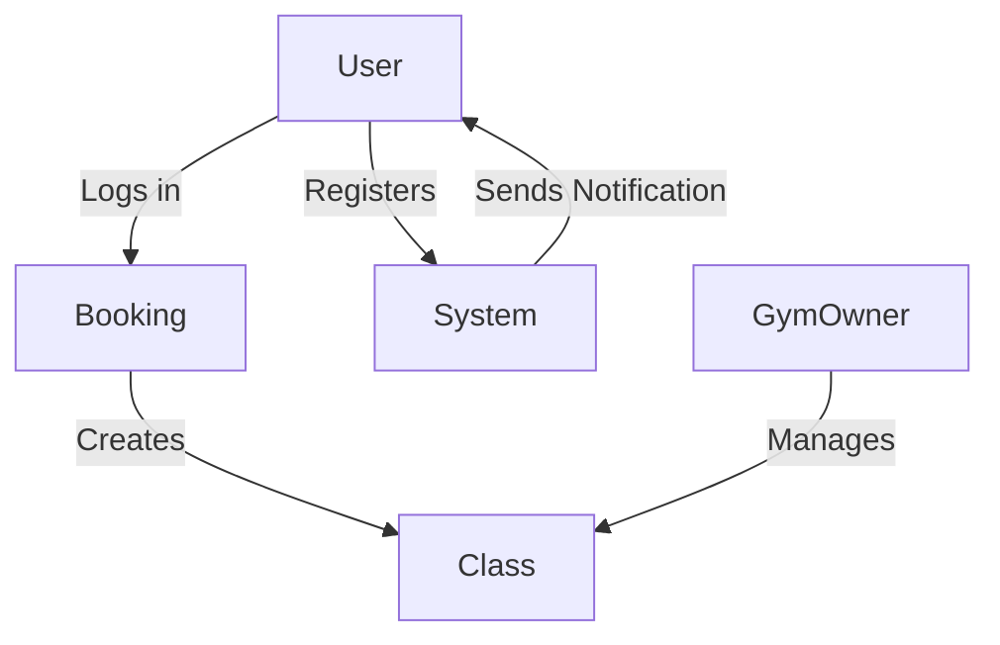

# Gym Booking System 🏋️‍♂️

> A digital gym booking system that allows members to book classes and training equipment.

---

## 🚀 Project Overview

### **Scenario**
Many gyms lack an efficient booking system, leading to overcrowding and frustration among members. This project aims to provide a seamless booking experience for gym members and administrators.

### **Goals**
✅ Develop a responsive web application\
✅ Implement user authentication\
✅ Enable class booking and cancellation\
✅ Provide an admin panel for gym owners

## 🎯 Stakeholders

| Stakeholder      | Role                            |
| ---------------- | ------------------------------- |
| Gym Member       | Books classes/equipment         |
| Gym Owner        | Manages classes and schedules   |
| System Developer | Implements and tests the system |
| Administrator    | Manages users and payments      |

## 🔍 Functional Requirements

- Users can register and log in to the system.
- Gym members can browse, book, and cancel classes.
- Gym owners can create, modify, and remove class schedules.
- A notification system sends reminders and updates to users.
- The system provides a dashboard with booking history and upcoming reservations.
- Membership payment processing is integrated.
- Role-based access control ensures secure management of user roles.

## 🛡️ Non-Functional Requirements

- 🔹 The system must handle **500 concurrent users**
- 🔹 The user interface must be **mobile-friendly**
- 🔹 Data must be **encrypted** for security
- 🔹 System uptime must be at least **99%**

## 📌 Prioritization (MoSCoW)

| Requirement               | Priority |
| ------------------------- | -------- |
| Registration and login    | Must     |
| Booking/canceling classes | Must     |
| Notification system       | Should   |
| Admin panel               | Should   |
| Payment integration       | Could    |

## 📖 User Stories

```yaml
As a gym member,
I want to book a class,
So that I can secure a spot.

As a gym owner,
I want to create and modify classes,
So that the schedule remains updated.

As a user,
I want to receive reminders for my bookings,
So that I don’t forget.
```

## 📌 Use Cases

### **1️⃣ Book a Class**

- **Pre-condition:** User is logged in.
- **Post-condition:** The class is booked, and a confirmation is sent.
- **Main Flow:** Select class → Book → Confirmation received.

### **2️⃣ Manage Classes**

- **Pre-condition:** Gym owner is logged in.
- **Post-condition:** The class is updated, and members are notified.
- **Main Flow:** Gym owner selects class → Modifies details → Saves changes.

## 📊 UML Class Diagram



## 📅 Project Timeline

| Sprint | Tasks                             | Duration  |
| ------ | --------------------------------- | --------- |
| 1️⃣    | Requirements gathering & design   | 1-2 weeks |
| 2️⃣    | Core functionality implementation | 3-5 weeks |
| 3️⃣    | Payment system integration        | 6-7 weeks |
| 4️⃣    | Final testing and improvements    | 8 weeks   |

## 📌 Development Workflow

- ✅ Scrum methodology with sprints
- ✅ Pair programming & code reviews
- ✅ Test-driven development (TDD)

## 🔄 Change Management

- 📌 Managed via backlog in **Jira/Trello**
- 📌 Version control through **GitHub**
- 📌 Change requests approved by **Project Manager**

## 🛠️ Installation & Setup

```bash
git clone https://github.com/your-repo-name.git
cd your-repo-name
npm install
npm start
```

## 📝 License

This project is licensed under the [MIT License](LICENSE).

## 🤝 Contributing

We welcome contributions! Feel free to fork this project and submit a pull request.

---

🚀 **Ready to make gym bookings seamless? Let’s build this together!**

